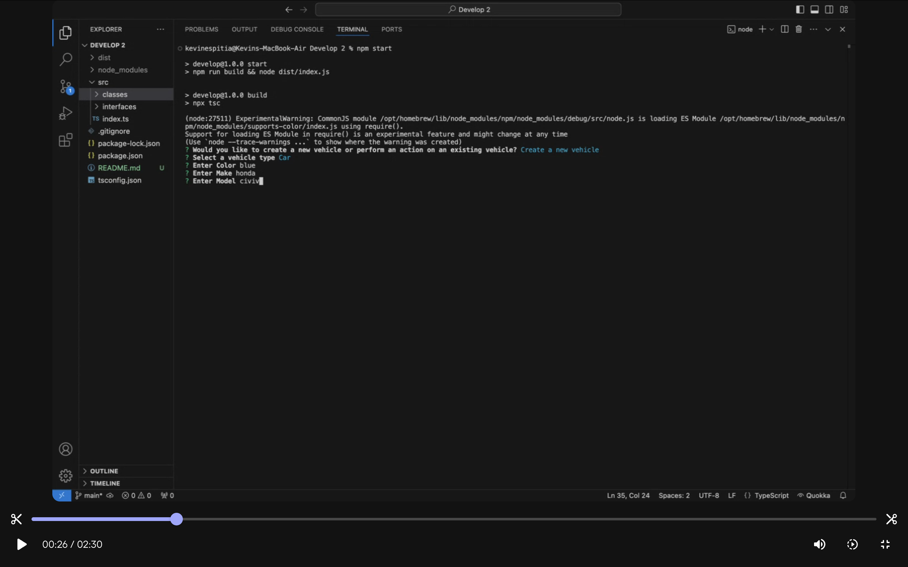

## Vehicle CLI

# Table of Contents
* [Task](#task)
* [User Story](#user-story)
* [Acceptance Criteria](#acceptance-criteria)
* [Additional Requirements](#additional-requirements)
* [Notes](#notes)
* [Video](#video)
* [Repository](#repository)


## Task
The task for this challenge was to be able to interact with the CLI application and also fix any bugs needed.


### User Story

```md
AS a developer
I WANT to update an existing application to include additional vehicle types
SO THAT I am able work with existing code bases.
```

## Acceptance Criteria

```md
GIVEN a command-line application 
WHEN I am prompted to create a new vehicle or existing vehicle
THEN I can choose between the new vehicle or existing vehicle
WHEN I am prompted to choose the vehicle type during creation
THEN I can choose between car, truck, and motorbike
WHEN I am prompted for details about the vehicle
THEN I can enter the vehicle information
WHEN I have entered all the vehicle information
THEN I can use the created vehicle
WHEN I select an existing vehicle
THEN I can use the selected existing vehicle
WHEN I have created a new vehicle or selected an existing vehicle
THEN I can perform actions with that vehicle
WHEN I perform an action with a vehicle
THEN I see the result of the action in the command-line
WHEN I complete the process of performing an action
THEN I can perform additional actions until I choose to exit
```

## Additional Requirements

Use [Inquirer](https://www.npmjs.com/package/inquirer) for collecting input from the user. The application will be invoked by using the following command:

```bash
npm start
```

## 📝 Notes
Speed up, slow down, wheelie, or tow! Each vehicle has specific actions available to it. A Motorbike only has 2 wheels and can't tow a Car. A Truck can tow a Car, but cannot perform a wheelie! 


## Preview 


## 🎥 Video

* Video: https://app.screencastify.com/v3/watch/NDbumdFWtRT4WnVvg9s9


## Repository

* Github repo: https://github.com/Kevinespitia1/Vehicle-CLI1